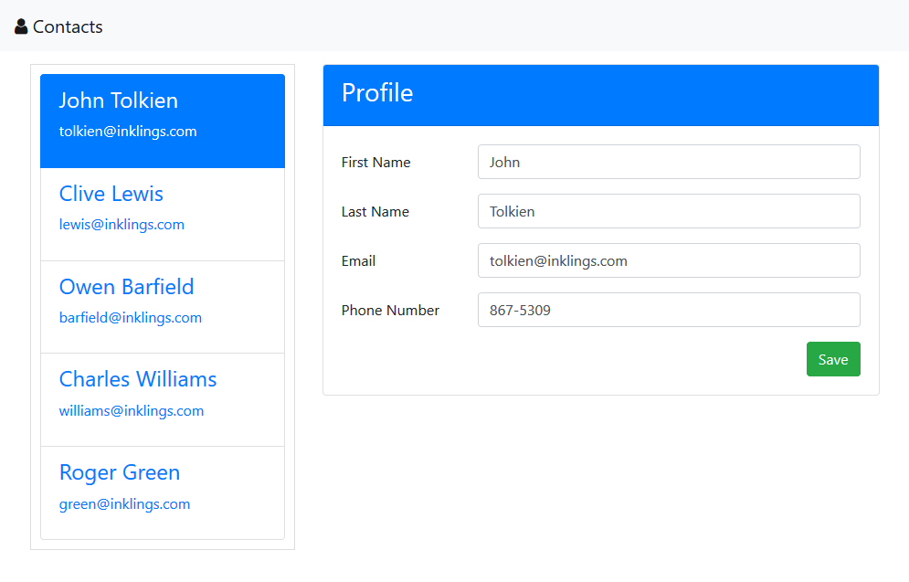
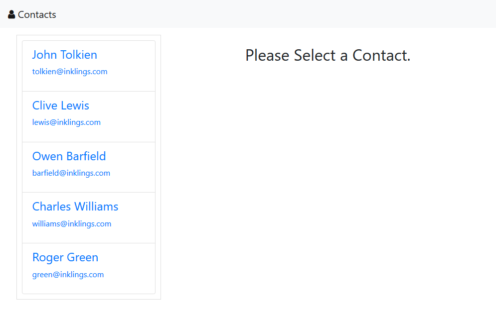
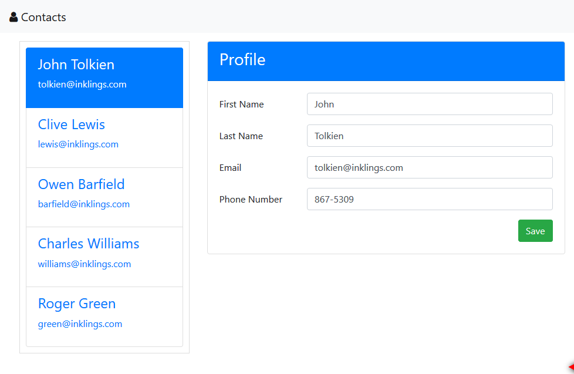

---
{
  "name": "Contact Manager Tutorial",
  "culture": "en-US",
  "description": "Now that you've got the basics down, you need to learn how to use the CLI, build a more complex app and get a solid knowledge foundation for real-world work. In this tutorial we'll build a small contact manager app and demonstrate a variety of Aurelia's features as well as learn some useful techniques.",
  "engines" : { "aurelia-doc" : "^1.0.0" },
  "author": {
  	"name": "Rob Eisenberg",
  	"url": "http://robeisenberg.com"
  },
  "contributors": [],
  "translators": [],
  "keywords": ["Getting Started", "ES2015", "ES2016", "TypeScript"]
}
---
## [Setting Up Your Machine](aurelia-doc://section/1/version/1.0.0)

For this tutorial, we're going to use the Aurelia CLI. If you've already setup your machine with the CLI, you can skip to the next section. If not, then please install the following CLI prerequisites:

* Install NodeJS version 4.x or above.
    * You can [download it here](https://nodejs.org/en/).
* Install a Git Client
    * Here's [a nice GUI client](https://desktop.github.com).
    * Here's [a standard client](https://git-scm.com).

Once you have the prerequisites installed, you can install the Aurelia CLI itself. From the command line, use npm to install the CLI globally:

```
npm install aurelia-cli -g
```

> Info
> Always run commands from a Bash prompt. Depending on your environment, you may need to use `sudo` when executing npm global installs.

> Warning
> While creating a new project doesn't require NPM 3, front-end development, in general, requires a flat-package structure, which is not available with NPM versions prior to 3. It is recommended that you update to NPM 3, which will be able to manage this structural requirement. You can check your NPM version with `npm -v`. If you need to update, run `npm install npm -g`.

## [Creating A New Aurelia Project](aurelia-doc://section/2/version/1.0.0)

Now, that you've got your machine setup, we can create our contact manager app. To create the project, run `au new` from the command line. You will be presented with a number of options. Name the project "contact-manager" and then select either the "Default ESNext" or "Default TypeScript" option depending on what is most comfortable for you. (Do not select "Custom" for this tutorial.)

Once you've made your choice, the CLI will show you your selections and ask if you'd like to create the file structure. Hit enter to accept the default "yes". After that, you'll be asked if you would like to install your new project's dependencies. Press enter to select the default "yes" for this as well.

Once the dependencies are installed (it will take a few minutes), your project is ready to go. Just change directory into the project folder and run it by typing `au run --watch`. This will run the app and watch the project's source for changes. Open a web browser and navigate to the url indicated in the CLI's output. If you've got everything setup correctly, you should see the message "Hello World!" in the browser.

## [Adding Required Assets](aurelia-doc://section/3/version/1.0.0)

For this tutorial, we're going to be working against a fake, in-memory backend. We've also pre-created the CSS and some utility functions, so we don't have to waste time on that here. Before we begin writing the app, you'll need to download these required assets and add them to your project.

<div style="text-align: center; margin-bottom: 32px">
  <a class="au-button" href="http://aurelia.io/downloads/contact-manager-assets.zip" target="_blank">Download the Contact Manager Assets</a>
</div>

Once you've downloaded the zip file, extract it and you'll find three files:

* `web-api.js` - The fake, in-memory backend.
* `utility.js` - Some helper functions used by the app.
* `styles.css` - The styles for this app.

Copy all of these files to the `src` folder of your project. TypeScript users should also rename the file extensions from `.js` to `.ts`.

## [Building the Application Shell](aurelia-doc://section/4/version/1.0.0)

> Warning
> Before proceeding any further, please make sure you are familiar with the concepts introduced in the Quick Start Guide or otherwise have some basic experience with Aurelia. Topics covered in the Quick Start will not be explained again here.

Let's start by looking at a picture of the final product of this tutorial. It will help us to see the application's structure and the pieces we need to build.



In the picture, you can see that we have a header across the top, a contact list on the left and a detail pane filling the rest of the space. We'll refer to the over-arching application structure, as the shell or layout of our app. Let's begin by putting that in place now.

To begin, we're going to setup our `App` class by configuring it with a router. We want our browser history to reflect which contact in our list is selected, so we'll introduce a client-side router to handle the navigation from screen to screen. Replace the code in your `app${context.language.fileExtension}` with the following:

<code-listing heading="app${context.language.fileExtension}">
  <source-code lang="ES 2015/ES Next">
    export class App {
      configureRouter(config, router){
        config.title = 'Contacts';
        config.map([
          { route: '',              moduleId: 'no-selection',   title: 'Select'},
          { route: 'contacts/:id',  moduleId: 'contact-detail', name:'contacts' }
        ]);

        this.router = router;
      }
    }
  </source-code>
  <source-code lang="TypeScript">
    import {Router, RouterConfiguration} from 'aurelia-router';

    export class App {
      router: Router;

      configureRouter(config: RouterConfiguration, router: Router){
        config.title = 'Contacts';
        config.map([
          { route: '',              moduleId: 'no-selection',   title: 'Select'},
          { route: 'contacts/:id',  moduleId: 'contact-detail', name:'contacts' }
        ]);

        this.router = router;
      }
    }
  </source-code>
</code-listing>

To add routing to your app, all you have to do is add a `configureRouter` method to your `App` class. The framework will call this method, passing it a `RouterConfiguration` and a `Router`. You can use the configuration object to get the router setup with the routes you want. Use the `map` method to map route patterns to the modules that should handle the patterns. Minimally, each route needs at least a `route` pattern and a `moduleId`.

In the case above, we are registering two routes. The first route is empty, indicated by `route: ''`. This will be the default route that is matched when there is no fragment. This route will cause the `no-selection` module to load. We'll use this to display a nice message to the user, if they haven't selected a contact to view. The second route has the pattern `contacts/:id`. This will match the literal `contacts/` followed by a parameter, which we've named `id`. When this route is matched, the router will load the `contact-detail` module so that we can display the selected contact.

There are a couple more points of interest with this configuration. First, notice that we've set the `config.title` property. This sets a base "title" to be used in the document's title for the browser. We can also set a `title` on each route. When we do that, the router's title and the matched route's title will be joined together to form the final document title. The second thing to notice is that the second route has a `name` property. We'll be able to use this later to generate routes without needing to copy/paste the route pattern everywhere. Instead, we can just refer to the route by name.

Now that we've configured our application's navigation structure, we need to put the visual structure in place. To do that, replace your `app.html` file with the following markup:

<code-listing heading="app.html">
  <source-code lang="HTML">
    <template>
      <require from="bootstrap/css/bootstrap.css"></require>
      <require from="./styles.css"></require>

      <nav class="navbar navbar-default navbar-fixed-top" role="navigation">
        <div class="navbar-header">
          <a class="navbar-brand" href="#">
            <i class="fa fa-user"></i>
            <span>Contacts</span>
          </a>
        </div>
      </nav>

      <div class="container">
        <div class="row">
          <div class="col-md-4">Contact List Placeholder</div>
          <router-view class="col-md-8"></router-view>
        </div>
      </div>
    </template>
  </source-code>
</code-listing>

There are several interesting things to note about this view. First, take a look at the `require` elements at the top of the view. This is how we can "import" or "require" various resources into our view. It's the view equivalent of the ES 2015 "import" syntax. Just as JavaScript is modularized and requires importing of other resources, so do Aurelia views. In this specific case, we're indicating that we want to bring in bootstrap's CSS as well as our own custom styles. Of course, we haven't actually installed Bootstrap yet. We'll get to that in a minute.

Below the `require` elements, you can see a pretty standard structure. We have some HTML to setup a navbar at the top. Below that we have the application's main container div. This has two columns. The first will contain our contact list, indicated by the placeholder div. The second contains a `router-view` custom element.

The `router-view` is provided by Aurelia and is a placeholder that indicated where the router should render the current route. This allows you to structure your application layout however you want, simply placing the `router-view` wherever you want to see the current page rendered. Whenever you have a `configureRouter` method, the view must also contain a `router-view`.

We're almost done setting up the application shell. Before we're done, we need to install Bootstrap. We'll be using that in this tutorial in order to give our application a decent appearance. In your own apps, you can use any CSS framework you like.

To get Bootstrap setup, we begin by installing the library itself with NPM. Execute the following on the command line to do this:

```
npm install bootstrap --save
```

Next, because Bootstrap uses jQuery, we want to install jQuery as well, like this:

```
npm install jquery@^2.2.4 --save
```
With these libraries installed, we now need to tell Aurelia which application bundle they should be included in and how to properly configure them with the module system. To do this, look in the `aurelia_project` folder and open up the `aurelia.json` file. This file contains all the information that the Aurelia CLI uses to build our project. If you scroll down, you will see a `bundles` section. There are two bundles defined by default: `app-bundle.js`, which contains your code and `vendor-bundle.js` which contains all 3rd party libraries. We need to add some new items to the `dependencies` array of the `vendor-bundle.js` bundle. Add the following two entries for jQuery and Bootstrap:

<code-listing heading="jQuery and Bootstrap Bundle Config">
  <source-code lang="JavaScript">
    "dependencies": [
      ...
      "jquery",
      {
        "name": "bootstrap",
        "path": "../node_modules/bootstrap/dist",
        "main": "js/bootstrap.min",
        "deps": ["jquery"],
        "exports": "$",
        "resources": [
          "css/bootstrap.css"
        ]
      },
      ...
    ]
  </source-code>
</code-listing>

You can read more about configuring 3rd party libraries in the documentation on the Aurelia CLI. For now, just know that this causes jQuery, Bootstrap and all necessary CSS to be included in the vendor bundle and makes it reachable through the module system.

## [Building Out the Default Route](aurelia-doc://section/5/version/1.0.0)

If you run the application now, you'll see a blank screen and the browser's console will display the following message:

```
Failed to load resource: the server responded with a status of 404 (Not Found) http://localhost:9000/src/no-selection.js
ERROR [app-router] Error: Script error for "no-selection"
```

This is actually expected. Why? Well, we have now configured a router, that router is matching on the empty route pattern we defined and it's trying to load the `no-selection` module, but we haven't created that yet. Let's do that now. Create a new file under `src` named `no-selection${context.language.fileExtension}` and give it the following code:

<code-listing heading="no-selection${context.language.fileExtension}">
  <source-code lang="ES 2015/ES Next">
    export class NoSelection {
      constructor() {
        this.message = "Please Select a Contact.";
      }
    }
  </source-code>
  <source-code lang="TypeScript">
    export class NoSelection {
      message = "Please Select a Contact.";
    }
  </source-code>
</code-listing>

This will provide the basic functionality for our "no selection" screen. All we want to do is display a message to our end user to select a contact. Now, let's add a view to render this view-model. Create another file named `no-selection.html` and add that to your `src` folder with the following contents:

<code-listing heading="no-selection.html">
  <source-code lang="HTML">
    <template>
      <div class="no-selection text-center">
        <h2>${message}</h2>
      </div>
    </template>
  </source-code>
</code-listing>

All it does is provide a container with some styling in order to display our message to the user. With this in place, you should now be able to run your application. If you haven't stopped/restarted it after editing the bundles, then you will need to do that now. When you run the application, you should see something like this:


## [Building Out the Contact List](aurelia-doc://section/6/version/1.0.0)

We've got the basic visual structure of our application in place and routing is now working. We've even created our first screen. However, it's not very interesting. We've got a `div` placeholder for the actual contact list at present. Let's go ahead and build that out, as a `contact-list` custom element.

Aurelia strives to be a self-consistent framework. As such, building a custom element is the same as creating your `App` component and your routed components. To create the `contact-list` custom element, start by creating a new file named `contact-list${context.language.fileExtension}` and add the following code:

<code-listing heading="contact-list${context.language.fileExtension}">
  <source-code lang="ES 2015">
    import {WebAPI} from './web-api';

    export class ContactList {
      static inject() { return [WebAPI] };

      constructor(api){
        this.api = api;
        this.contacts = [];
      }

      created(){
        this.api.getContactList().then(contacts => this.contacts = contacts);
      }

      select(contact){
        this.selectedId = contact.id;
        return true;
      }
    }
  </source-code>
  <source-code lang="ES Next">
    import {WebAPI} from './web-api';
    import {inject} from 'aurelia-framework';

    @inject(WebAPI)
    export class ContactList {
      constructor(api){
        this.api = api;
        this.contacts = [];
      }

      created(){
        this.api.getContactList().then(contacts => this.contacts = contacts);
      }

      select(contact){
        this.selectedId = contact.id;
        return true;
      }
    }
  </source-code>
  <source-code lang="TypeScript">
    import {WebAPI} from './web-api';
    import {inject} from 'aurelia-framework';

    @inject(WebAPI)
    export class ContactList {
      contacts;
      selectedId = 0;

      constructor(private api: WebAPI){ }

      created(){
        this.api.getContactList().then(contacts => this.contacts = contacts);
      }

      select(contact){
        this.selectedId = contact.id;
        return true;
      }
    }
  </source-code>
</code-listing>

> Note that we use a dashed naming convention to separate the words *contact-list* as our custom element name. The name of the class instead should be defined by using the UpperCammelCase version *ContactList*

The view-model for our custom element has a few notable characteristics. First, we're using dependency injection. Aurelia has its own dependency injection container, which it uses to instantiate classes in your app. Classes can declare constructor dependencies through *inject metadata*. This looks a bit different depending on what language you are using. In ES 2015, you can declare an `inject` static method that returns an array of constructor dependencies while in ES Next and TypeScript, you can use an `inject` decorator to declare those dependencies. As you can see here, our `ContactList` class has a dependency on our `WebAPI` class. When Aurelia instantiates the contact list, it will first instantiate (or locate) an instance of the web API and "inject" that into the contact list's constructor.

The second thing to notice is the `created` method. All Aurelia components follow a component life-cycle. A developer can opt into any stage of the life-cycle by implementing the appropriate methods. In this case, we're implementing into the `created` hook which gets called after both the view-model and the view are created. We're using this as an opportunity to call our API and get back the list of contacts, which we then store in our `contacts` property so we can bind it in the view.

Finally, we have a `select` method for selecting a contact. We'll revisit this shortly, after we take a look at how it's used in the view. On that note, create a `contact-list.html` file and use the following code for the view:

<code-listing heading="contact-list.html">
  <source-code lang="HTML">
    <template>
      <div class="contact-list">
        <ul class="list-group">
          <li repeat.for="contact of contacts" class="list-group-item ${contact.id === $parent.selectedId ? 'active' : ''}">
            <a route-href="route: contacts; params.bind: {id:contact.id}" click.delegate="$parent.select(contact)">
              <h4 class="list-group-item-heading">${contact.firstName} ${contact.lastName}</h4>
              <p class="list-group-item-text">${contact.email}</p>
            </a>
          </li>
        </ul>
      </div>
    </template>
  </source-code>
</code-listing>

The markup above begins by repeating an `li` for each contact of our contacts array. Take a look at the class attribute on the `li`. We've used an interesting technique here to add an `active` class if the contact's id is the same as the `selectedId` of the contact on our `ContactList` view-model. We've used the `$parent` special value to reach outside of the list's scope and into the parent view-model so we can test against that property. Throughout the list template, we've used basic string interpolation binding to show the `firstName`, `lastName` and `email` of each contact.

Take special note of the `a` tag. First, we are using a custom attribute provided by Aurelia's routing system: `route-href`. This attribute can generate an href for a route, based on the route's name and a set of parameters. Remember how we named the contacts route in our configuration? Here we're using that by referencing the "contacts" route name and binding the contacts's `id` parameter as the route's `id` parameter. With this information, the router is able to generate the correct `href` on the `a` tag for each contact. Additionally, we've also wired up a `click` event. Why would we do this if the `href` is already going to handle navigating to the correct contact? Well, we're looking for instant user feedback. We want the list selection to happen ASAP, so we don't have to wait on the navigation system or on the loading of the contact data. To accomplish this, we use the `select` method to track the selected contact's `id`, which allows us to instantly apply the selection style. Finally, normal use of `.trigger` or `.delegate` causes the default action of the event to be cancelled. But, if you return true from your method, as we have done above, it will be allowed to continue. Thus, when the user clicks on the contact, we immediately select the contact in the list and then the `href` is allowed to trigger the router, causing a navigation to the selected contact.

Ok, now that we've got the contact list built, we need to use it. To do that, update your `app.html` with the following markup:

<code-listing heading="app.html">
  <source-code lang="HTML">
    <template>
      <require from="bootstrap/css/bootstrap.css"></require>
      <require from="./styles.css"></require>
      <require from="./contact-list"></require>

      <nav class="navbar navbar-default navbar-fixed-top" role="navigation">
        <div class="navbar-header">
          <a class="navbar-brand" href="#">
            <i class="fa fa-user"></i>
            <span>Contacts</span>
          </a>
        </div>
      </nav>

      <div class="container">
        <div class="row">
          <contact-list class="col-md-4"></contact-list>
          <router-view class="col-md-8"></router-view>
        </div>
      </div>
    </template>
  </source-code>
</code-listing>

There are two important additions. First, we've added another `require` element at the top, to import our new `contact-list` into this view. Remember that views are encapsulated, just like modules. So, this makes the `contact-list` visible from within this view. Second, we now use the custom element, right above our `router-view`.

If you go ahead and run the application, you should now see something like this:



## [Building Out the Contact Detail Screen](aurelia-doc://section/7/version/1.0.0)

Ok, things are starting to come together, but we still can't view an individual contact. If you try selecting something from the list, you'll see an error like the following in the console:

```
ERROR [app-router] Error: Script error for "contact-detail"
```

Again, this is because the router is trying to route to the detail screen, but we have not yet created the component. So, let's do that next. Create a new file named `contact-detail${context.language.fileExtension}` and add the following code:

<code-listing heading="contact-detail${context.language.fileExtension}">
  <source-code lang="ES 2015">
    import {WebAPI} from './web-api';
    import {areEqual} from './utility';

    export class ContactDetail {
      static inject() { return [WebAPI]; }

      constructor(api){
        this.api = api;
      }

      activate(params, routeConfig) {
        this.routeConfig = routeConfig;

        return this.api.getContactDetails(params.id).then(contact => {
          this.contact = contact;
          this.routeConfig.navModel.setTitle(contact.firstName);
          this.originalContact = JSON.parse(JSON.stringify(contact));
        });
      }

      get canSave() {
        return this.contact.firstName && this.contact.lastName && !this.api.isRequesting;
      }

      save() {
        this.api.saveContact(this.contact).then(contact => {
          this.contact = contact;
          this.routeConfig.navModel.setTitle(contact.firstName);
          this.originalContact = JSON.parse(JSON.stringify(contact));
        });
      }

      canDeactivate() {
        if (!areEqual(this.originalContact, this.contact)){
          return confirm('You have unsaved changes. Are you sure you wish to leave?');
        }

        return true;
      }
    }
  </source-code>
  <source-code lang="ES Next">
    import {inject} from 'aurelia-framework';
    import {WebAPI} from './web-api';
    import {areEqual} from './utility';

    @inject(WebAPI)
    export class ContactDetail {
      constructor(api){
        this.api = api;
      }

      activate(params, routeConfig) {
        this.routeConfig = routeConfig;

        return this.api.getContactDetails(params.id).then(contact => {
          this.contact = contact;
          this.routeConfig.navModel.setTitle(contact.firstName);
          this.originalContact = JSON.parse(JSON.stringify(contact));
        });
      }

      get canSave() {
        return this.contact.firstName && this.contact.lastName && !this.api.isRequesting;
      }

      save() {
        this.api.saveContact(this.contact).then(contact => {
          this.contact = contact;
          this.routeConfig.navModel.setTitle(contact.firstName);
          this.originalContact = JSON.parse(JSON.stringify(contact));
        });
      }

      canDeactivate() {
        if (!areEqual(this.originalContact, this.contact)){
          return confirm('You have unsaved changes. Are you sure you wish to leave?');
        }

        return true;
      }
    }
  </source-code>
  <source-code lang="TypeScript">
    import {inject} from 'aurelia-framework';
    import {WebAPI} from './web-api';
    import {areEqual} from './utility';

    interface Contact {
      firstName: string;
      lastName: string;
      email: string;
    }

    @inject(WebAPI)
    export class ContactDetail {
      routeConfig;
      contact: Contact;
      originalContact: Contact;

      constructor(private api: WebAPI) { }

      activate(params, routeConfig) {
        this.routeConfig = routeConfig;

        return this.api.getContactDetails(params.id).then(contact => {
          this.contact = <Contact>contact;
          this.routeConfig.navModel.setTitle(this.contact.firstName);
          this.originalContact = JSON.parse(JSON.stringify(this.contact));
        });
      }

      get canSave() {
        return this.contact.firstName && this.contact.lastName && !this.api.isRequesting;
      }

      save() {
        this.api.saveContact(this.contact).then(contact => {
          this.contact = <Contact>contact;
          this.routeConfig.navModel.setTitle(this.contact.firstName);
          this.originalContact = JSON.parse(JSON.stringify(this.contact));
        });
      }

      canDeactivate() {
        if (!areEqual(this.originalContact, this.contact)) {
          return confirm('You have unsaved changes. Are you sure you wish to leave?');
        }

        return true;
      }
    }
  </source-code>
</code-listing>

Once again, we are using dependency injection to get an instance of our `WebAPI`. We need this to load the contact detail data. Next, we implement a method named `activate`. Remember when we mentioned that all components have a life-cycle? Well, there are additional life-cycle methods for *routed components*. `activate` is one such method and it gets invoked right before the router is about to activate the component. This is also how the router passes the component its route parameters. Let's dig in a bit more.

The first argument passed to `activate` is the `params` object. This object will have one property for every route param that was parsed as well as a property for each query string parameter. If you recall, our route pattern for the contact details screen was `contacts/:id`. So, our `params` object will have an `id` property with the requested contact's id. Using this `id` we call our `WebAPI` to retrieve the contact data. This API returns a `Promise` which we wait on and then store the loaded contact in a `contact` property so it's easy to bind to. We also make a copy of this object and store it in the `originalContact` property, so we can do some rudimentary checking to see if the data has been edited by the user at a later point.

The second argument passed to `activate` is the `routeConfig`. This is the same configuration object that you created to configure the router itself. You can get access to that here so that you can access any of its properties. The router generates a `navModel` for each `routeConfig`. Using the `navModel` you can dynamically set the title of the document for this route. So, we call `navModel.setTitle()` in order to set up the document's title with the name of the contact that we just loaded.

This screen demonstrates another part of the navigation lifecycle available to routed components: the `canDeactivate` hook. If present, this method is called before navigating away from the current component. It gives your component an opportunity to cancel navigation, if it desires.  In the case of the contact detail screen, we are comparing our `originalContact` to the current `contact`, using our `areEqual` helper method, in order to determine whether or not the user has made any changes to the data. If they have, we show a confirmation dialog to make sure they want to navigate away, since they would lose their changes. If the `canDeactivate` hook returns `true`, navigation is allowed; if false is returned, it is prevented and the route state is reverted.

If we take a brief look at the `save` method, we can see that this is just a brief call to the `WebAPI`'s `saveContact` method. After that succeeds, we update our `originalContact` to the latest version and then we update the document's title with the potentially new contact name.

Finally, we have a `canSave` computed property which we'll use in the view. This will help us show some simple feedback to the user to indicate whether the UI and data are in a state that allows for saving.

With that all in place, let's look at the view that will render this component. Create a new file named `contact-detail.html`.

<code-listing heading="contact-detail.html">
  <source-code lang="HTML">
    <template>
      <div class="panel panel-primary">
        <div class="panel-heading">
          <h3 class="panel-title">Profile</h3>
        </div>
        <div class="panel-body">
          <form role="form" class="form-horizontal">
            <div class="form-group">
              <label class="col-sm-2 control-label">First Name</label>
              <div class="col-sm-10">
                <input type="text" placeholder="first name" class="form-control" value.bind="contact.firstName">
              </div>
            </div>

            <div class="form-group">
              <label class="col-sm-2 control-label">Last Name</label>
              <div class="col-sm-10">
                <input type="text" placeholder="last name" class="form-control" value.bind="contact.lastName">
              </div>
            </div>

            <div class="form-group">
              <label class="col-sm-2 control-label">Email</label>
              <div class="col-sm-10">
                <input type="text" placeholder="email" class="form-control" value.bind="contact.email">
              </div>
            </div>

            <div class="form-group">
              <label class="col-sm-2 control-label">Phone Number</label>
              <div class="col-sm-10">
                <input type="text" placeholder="phone number" class="form-control" value.bind="contact.phoneNumber">
              </div>
            </div>
          </form>
        </div>
      </div>

      <div class="button-bar">
        <button class="btn btn-success" click.delegate="save()" disabled.bind="!canSave">Save</button>
      </div>
    </template>
  </source-code>
</code-listing>

Don't be intimidated by the amount of HTML above. It's mostly all basic form controls and bootstrap structures. If you look at the `input` elements, you will see that they all have a two-way binding to the appropriate contact's properties. The only real interesting part is the `button` element at the bottom. This button invokes `save` when clicked, but notice that it also has its `disabled` attribute bound to our `canSave` property. The result is that the user won't be able to save if the API is in the middle of a request or if there is missing contact information.

You should now be able to select contacts in the list, see their details, edit them, save and even see the confirm dialog on unsaved data navigations. It should look something like this:



## [Adding Pub/Sub Messaging](aurelia-doc://section/8/version/1.0.0)

If you play around with the application for a bit, you'll notice a few "buggy" behaviors:

* Refreshing the browser with a contact selected results in the correct contact being shown, but not in the correct contact list item being highlighted.
* If you edit some data, try to navigate away and then cancel, the contact list item selection will go out of sync, highlighting the contact you were going to before you cancelled, but not the current contact.
* If you edit some data and save, you will notice that changes in the name are not reflected in the list.

The reason for these issues is that we have two separate components, our `contact-list` and our `contact-detail` which both have their own internal data structures and behaviors, but which do have an affect on each other. The router is controlling the contact detail screen, so it's the ultimate source of truth and the contact list should sync with it. To handle this, we're going to increase the amount of information in our system by introducing pub/sub. Let's create a couple of messages that our `contact-detail` component can publish and then let the `contact-list` subscribe to those and respond appropriately.

<code-listing heading="messages${context.language.fileExtension}">
  <source-code lang="ES 2015">
    export class ContactUpdated {
      constructor(contact){
        this.contact = contact;
      }
    }

    export class ContactViewed {
      constructor(contact){
        this.contact = contact;
      }
    }
  </source-code>
  <source-code lang="ES Next">
    export class ContactUpdated {
      constructor(contact){
        this.contact = contact;
      }
    }

    export class ContactViewed {
      constructor(contact){
        this.contact = contact;
      }
    }
  </source-code>
  <source-code lang="TypeScript">
    export class ContactUpdated {
      constructor(public contact){ }
    }

    export class ContactViewed {
      constructor(public contact){ }
    }
  </source-code>
</code-listing>

Whenever the contact detail screen successfully saves a contact, we'll publish the `ContactUpdated` message and whenever the end user begins viewing a new contact, we'll publish the `ContactViewed` message. Each of these messages will carry the contact data along with it so that subscribers have contextual data related to the event. Next, let's update our `contact-detail` code to incorporate Aurelia's `EventAggregator` and publish the messages at the appropriate time:

<code-listing heading="contact-detail${context.language.fileExtension}">
  <source-code lang="ES 2015">
    import {EventAggregator} from 'aurelia-event-aggregator';
    import {WebAPI} from './web-api';
    import {ContactUpdated,ContactViewed} from './messages';
    import {areEqual} from './utility';

    export class ContactDetail {
      static inject = [WebAPI, EventAggregator];

      constructor(api, ea){
        this.api = api;
        this.ea = ea;
      }

      activate(params, routeConfig) {
        this.routeConfig = routeConfig;

        return this.api.getContactDetails(params.id).then(contact => {
          this.contact = contact;
          this.routeConfig.navModel.setTitle(contact.firstName);
          this.originalContact = JSON.parse(JSON.stringify(contact));
          this.ea.publish(new ContactViewed(this.contact));
        });
      }

      get canSave() {
        return this.contact.firstName && this.contact.lastName && !this.api.isRequesting;
      }

      save() {
        this.api.saveContact(this.contact).then(contact => {
          this.contact = contact;
          this.routeConfig.navModel.setTitle(contact.firstName);
          this.originalContact = JSON.parse(JSON.stringify(contact));
          this.ea.publish(new ContactUpdated(this.contact));
        });
      }

      canDeactivate() {
        if(!areEqual(this.originalContact, this.contact)){
          let result = confirm('You have unsaved changes. Are you sure you wish to leave?');

          if(!result){
            this.ea.publish(new ContactViewed(this.contact));
          }

          return result;
        }

        return true;
      }
    }
  </source-code>
  <source-code lang="ES Next">
    import {inject} from 'aurelia-framework';
    import {EventAggregator} from 'aurelia-event-aggregator';
    import {WebAPI} from './web-api';
    import {ContactUpdated,ContactViewed} from './messages';
    import {areEqual} from './utility';

    @inject(WebAPI, EventAggregator)
    export class ContactDetail {
      constructor(api, ea){
        this.api = api;
        this.ea = ea;
      }

      activate(params, routeConfig) {
        this.routeConfig = routeConfig;

        return this.api.getContactDetails(params.id).then(contact => {
          this.contact = contact;
          this.routeConfig.navModel.setTitle(contact.firstName);
          this.originalContact = JSON.parse(JSON.stringify(contact));
          this.ea.publish(new ContactViewed(this.contact));
        });
      }

      get canSave() {
        return this.contact.firstName && this.contact.lastName && !this.api.isRequesting;
      }

      save() {
        this.api.saveContact(this.contact).then(contact => {
          this.contact = contact;
          this.routeConfig.navModel.setTitle(contact.firstName);
          this.originalContact = JSON.parse(JSON.stringify(contact));
          this.ea.publish(new ContactUpdated(this.contact));
        });
      }

      canDeactivate() {
        if(!areEqual(this.originalContact, this.contact)){
          let result = confirm('You have unsaved changes. Are you sure you wish to leave?');

          if(!result){
            this.ea.publish(new ContactViewed(this.contact));
          }

          return result;
        }

        return true;
      }
    }
  </source-code>
  <source-code lang="TypeScript">
    import {inject} from 'aurelia-framework';
    import {EventAggregator} from 'aurelia-event-aggregator';
    import {WebAPI} from './web-api';
    import {ContactUpdated,ContactViewed} from './messages';
    import {areEqual} from './utility';

    interface Contact {
      firstName: string;
      lastName: string;
      email: string;
    }

    @inject(WebAPI, EventAggregator)
    export class ContactDetail {
      routeConfig;
      contact: Contact;
      originalContact: Contact;

      constructor(private api: WebAPI, private ea: EventAggregator) { }

      activate(params, routeConfig) {
        this.routeConfig = routeConfig;

        return this.api.getContactDetails(params.id).then(contact => {
          this.contact = <Contact>contact;
          this.routeConfig.navModel.setTitle(this.contact.firstName);
          this.originalContact = JSON.parse(JSON.stringify(this.contact));
          this.ea.publish(new ContactViewed(this.contact));
        });
      }

      get canSave() {
        return this.contact.firstName && this.contact.lastName && !this.api.isRequesting;
      }

      save() {
        this.api.saveContact(this.contact).then(contact => {
          this.contact = <Contact>contact;
          this.routeConfig.navModel.setTitle(this.contact.firstName);
          this.originalContact = JSON.parse(JSON.stringify(this.contact));
          this.ea.publish(new ContactUpdated(this.contact));
        });
      }

      canDeactivate() {
        if(!areEqual(this.originalContact, this.contact)){
          let result = confirm('You have unsaved changes. Are you sure you wish to leave?');

          if(!result){
            this.ea.publish(new ContactViewed(this.contact));
          }

          return result;
        }

        return true;
      }
    }
  </source-code>
</code-listing>

First, notice that we've both imported Aurelia's `EventAggregator` and configured it to be injected into the constructor of our `ContactDetail` class. We've also imported the two messages we created. Whenever a contact is loaded, we publish the `ContactViewed` message. Whenever a contact is saved, we publish the `ContactUpdated` message. Finally, if the user attempts to navigate away, but cancels, we reflect this by publishing another `ContactViewed` message, representing that they are returning to view the current contact.

With these messages in place, we can now enable any other component in our system to loosely subscribe to the new information in our system and use that data as appropriate to its internal needs. We'll go ahead and update the `contact-list` component to take advantage of this information to ensure that it is always in sync:

<code-listing heading="contact-list${context.language.fileExtension}">
  <source-code lang="ES 2015">
    import {EventAggregator} from 'aurelia-event-aggregator';
    import {WebAPI} from './web-api';
    import {ContactUpdated, ContactViewed} from './messages';

    export class ContactList {
      static inject = [WebAPI, EventAggregator];

      constructor(api, ea){
        this.api = api;
        this.contacts = [];

        ea.subscribe(ContactViewed, msg => this.select(msg.contact));
        ea.subscribe(ContactUpdated, msg => {
          let id = msg.contact.id;
          let found = this.contacts.find(x => x.id === id);
          Object.assign(found, msg.contact);
        });
      }

      created(){
        this.api.getContactList().then(contacts => this.contacts = contacts);
      }

      select(contact){
        this.selectedId = contact.id;
        return true;
      }
    }
  </source-code>
  <source-code lang="ES Next">
    import {EventAggregator} from 'aurelia-event-aggregator';
    import {WebAPI} from './web-api';
    import {ContactUpdated, ContactViewed} from './messages';
    import {inject} from 'aurelia-framework';

    @inject(WebAPI, EventAggregator)
    export class ContactList {
      constructor(api, ea){
        this.api = api;
        this.contacts = [];

        ea.subscribe(ContactViewed, msg => this.select(msg.contact));
        ea.subscribe(ContactUpdated, msg => {
          let id = msg.contact.id;
          let found = this.contacts.find(x => x.id == id);
          Object.assign(found, msg.contact);
        });
      }

      created(){
        this.api.getContactList().then(contacts => this.contacts = contacts);
      }

      select(contact){
        this.selectedId = contact.id;
        return true;
      }
    }
  </source-code>
  <source-code lang="TypeScript">
    import {EventAggregator} from 'aurelia-event-aggregator';
    import {WebAPI} from './web-api';
    import {ContactUpdated, ContactViewed} from './messages';
    import {inject} from 'aurelia-framework';

    @inject(WebAPI, EventAggregator)
    export class ContactList {
      contacts;
      selectedId = 0;

      constructor(private api: WebAPI, ea: EventAggregator){
        ea.subscribe(ContactViewed, msg => this.select(msg.contact));
        ea.subscribe(ContactUpdated, msg => {
          let id = msg.contact.id;
          let found = this.contacts.find(x => x.id == id);
          Object.assign(found, msg.contact);
        });
      }

      created(){
        this.api.getContactList().then(contacts => this.contacts = contacts);
      }

      select(contact){
        this.selectedId = contact.id;
        return true;
      }
    }
  </source-code>
</code-listing>

As you can see, we've just imported and injected our `EventAggregator` and then it's as simple as calling the `subscribe` method and passing it the message type and a callback. When the message is published, your callback is fired and passed the instance of the message type. In this case, we use these messages to update our selection as well as the details of the contact that are relevant to our list.

If you run the application now, you should see that everything is working as expected.

## [Adding A Loading Indicator](aurelia-doc://section/9/version/1.0.0)

Let's add one more final touch to this application. Whenever we're navigating from screen to screen or making a `WebAPI` request, let's show a loading indicator at the top of our app. To do this, we'll use a 3rd party library and create a custom Aurelia element to wrap it up.

Begin by installing the `nprogress` library with the following command:

```
npm install nprogress --save
```

Once this is installed, we'll need to make sure it gets configured in the proper bundle. Open your `aurelia.json` file again, find the bundles section and add the following entry to the dependencies array of the `vendor-bundle.js` bundle:

<code-listing heading="NProgress Bundle Config">
  <source-code lang="JavaScript">
    "dependencies": [
      ...
      {
        "name": "nprogress",
        "path": "../node_modules/nprogress",
        "main": "nprogress",
        "resources": [
          "nprogress.css"
        ]
      }
      ...
    ]
  </source-code>
</code-listing>

As you can see, we've configured the standard JavaScript main but are also including an additional CSS resource, just like we did with Bootstrap.

> Info: TypeScript Definition Files
> TypeScript users should note that when using 3rd party libraries, in order to make them work in a TypeScript project, you will either need to install the d.ts files or create them for yourself. In the case of NProgress, there are definition files available via Definitely Typed which can be installed with the Typings CLI. Assuming you have the Typings tool installed, you would install the definition files for NProgress with the following command: `typings install dt~nprogress --global --save
`

With that in place, let's create our `loading-indicator` custom element. In the `src/resources/elements` folder create a file named `loading-indicator${context.language.fileExtension}` and use the code below for its implementation:

<code-listing heading="loading-indicator${context.language.fileExtension}">
  <source-code lang="ES 2015">
    import * as nprogress from 'nprogress';
    import {bindable, noView, decorators} from 'aurelia-framework';

    export let LoadingIndicator = decorators(
      noView(['nprogress/nprogress.css']),
      bindable({name: 'loading', defaultValue: false})
    ).on(class {
      loadingChanged(newValue){
        if (newValue) {
          nprogress.start();
        } else {
          nprogress.done();
        }
      }
    });
  </source-code>
  <source-code lang="ES Next">
    import * as nprogress from 'nprogress';
    import {bindable, noView} from 'aurelia-framework';

    @noView(['nprogress/nprogress.css'])
    export class LoadingIndicator {
      @bindable loading = false;

      loadingChanged(newValue){
        if (newValue) {
          nprogress.start();
        } else {
          nprogress.done();
        }
      }
    }
  </source-code>
  <source-code lang="TypeScript">
    import * as nprogress from 'nprogress';
    import {bindable, noView} from 'aurelia-framework';

    @noView(['nprogress/nprogress.css'])
    export class LoadingIndicator {
      @bindable loading = false;

      loadingChanged(newValue){
        if (newValue) {
          nprogress.start();
        } else {
          nprogress.done();
        }
      }
    }
  </source-code>
</code-listing>

This code creates a custom element, but we're doing a few unique things here. First, since the entire rendering job is handled by the NProgress library, we don't need Aurelia's templating engine to render this component at all. So, we use the `noView()` decorator to tell Aurelia not to load a `loading-indicator.html`, compile it or do any of that rendering work. Additionally, the NProgress library requires some CSS to work, so we can declare that in the decorator as well. In the case of `noView`, this works exactly as if you had put this in a `require` element inside the view.

Next, we want our custom HTML element to have a `loading` property that we can bind to via an HTML attribute in the DOM. So, we declare that by using the `bindable` decorator. Whenever you have a `bindable`, by convention, you can optionally declare a *propertyName*Changed method that will be called whenever the binding system updates the property. So, we've added one of those so that we can toggle the NProgress indicator off and on, based on the value of that property.

Previously, when we created the `contact-list` component, we required that into the `app.html` view and used it, since all views are encapsulated. However, we're going to do something different in this case, as an example. Aurelia actually gives you the ability to globalize view resources, such as custom elements. This is a convenience so that you don't have to require common resources repeatedly into every view. To do this, we need to register our element as a global resource. Open up the `resources/index${context.language.fileExtension}` file that's already in your solution, and change the code so that it has the registration as follows:

<code-listing heading="resources/index${context.language.fileExtension}">
  <source-code lang="ES 2015">
    export function configure(config) {
      config.globalResources(['./elements/loading-indicator']);
    }
  </source-code>
  <source-code lang="ES Next">
    export function configure(config) {
      config.globalResources(['./elements/loading-indicator']);
    }
  </source-code>
  <source-code lang="TypeScript">
    import {FrameworkConfiguration} from 'aurelia-framework';

    export function configure(config: FrameworkConfiguration) {
      config.globalResources(['./elements/loading-indicator']);
    }
  </source-code>
</code-listing>

With this registration in place, we can now use our new indicator in our `app.html`, but before we do that, we want to make one more change to our `app${context.language.fileExtension}`. We would like to be able to bind the indicator to the request state of our API, so we need to make that available in our `App` class. Update your `app${context.language.fileExtension}` as follows:

<code-listing heading="app${context.language.fileExtension}">
  <source-code lang="ES 2015">
    import {WebAPI} from './web-api';

    export class App {
      static inject() { return [WebAPI]; }

      constructor(api) {
        this.api = api;
      }

      configureRouter(config, router){
        config.title = 'Contacts';
        config.map([
          { route: '',              moduleId: 'no-selection',   title: 'Select'},
          { route: 'contacts/:id',  moduleId: 'contact-detail', name:'contacts' }
        ]);

        this.router = router;
      }
    }
  </source-code>
  <source-code lang="ES Next">
    import {inject} from 'aurelia-framework';
    import {WebAPI} from './web-api';

    @inject(WebAPI)
    export class App {
      constructor(api) {
        this.api = api;
      }

      configureRouter(config, router){
        config.title = 'Contacts';
        config.map([
          { route: '',              moduleId: 'no-selection',   title: 'Select'},
          { route: 'contacts/:id',  moduleId: 'contact-detail', name:'contacts' }
        ]);

        this.router = router;
      }
    }
  </source-code>
  <source-code lang="TypeScript">
    import {Router, RouterConfiguration} from 'aurelia-router';
    import {inject} from 'aurelia-framework';
    import {WebAPI} from './web-api';

    @inject(WebAPI)
    export class App {
      router: Router;

      constructor(public api: WebAPI) {}

      configureRouter(config: RouterConfiguration, router: Router){
        config.title = 'Contacts';
        config.map([
          { route: '',              moduleId: 'no-selection',   title: 'Select'},
          { route: 'contacts/:id',  moduleId: 'contact-detail', name:'contacts' }
        ]);

        this.router = router;
      }
    }
  </source-code>
</code-listing>

Ok, now that we've got an `api` property we can bind to, update your `app.html` to the final version that adds the `loading-indicator` and binds its `loading` property:

<code-listing heading="app.html">
  <source-code lang="HTML">
    <template>
      <require from="bootstrap/css/bootstrap.css"></require>
      <require from="./styles.css"></require>
      <require from="./contact-list"></require>

      <nav class="navbar navbar-default navbar-fixed-top" role="navigation">
        <div class="navbar-header">
          <a class="navbar-brand" href="#">
            <i class="fa fa-user"></i>
            <span>Contacts</span>
          </a>
        </div>
      </nav>

      <loading-indicator loading.bind="router.isNavigating || api.isRequesting"></loading-indicator>

      <div class="container">
        <div class="row">
          <contact-list class="col-md-4"></contact-list>
          <router-view class="col-md-8"></router-view>
        </div>
      </div>
    </template>
  </source-code>
</code-listing>

And with that, we've finished our app. Congratulations!

## [Next Steps](aurelia-doc://section/10/version/1.0.0)

Now that you've completed the tutorial, you may want to consider doing some additional research or development exercises to continue your learning and hone your skills. Here are a few ideas:

* Create a real backend for the app and use the [http-client or fetch-client](#/doc/article/aurelia/fetch-client/latest/http-services) to retrieve the data.
* Extend that application so that new contacts can be added.
* Extend the contact detail form with data validation.
* Learn more about [the component life-cycle](#/doc/article/aurelia/framework/latest/creating-components/1).
* Learn more about [the navigation life-cycle and routing](#/doc/article/aurelia/framework/latest/cheat-sheet/7).
* Expand your knowledge of [binding](#/doc/article/aurelia/binding/latest/binding-basics) and [templating](#/doc/article/aurelia/templating/latest/templating-basics).

## [Conclusion](aurelia-doc://section/11/version/1.0.0)

This tutorial presents a fairly simple application, but it provides an opportunity to demonstrate a number of interesting techniques. We hope it's helped you along in the process of learning Aurelia and we look forward to seeing what things you will build next.
