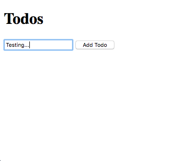

---
{
  "name": "Quick Start",
  "culture": "en-US",
  "description": "Welcome to Aurelia! This quick start guide will take you through creating a Todo app using Aurelia and briefly explain its main concepts. We assume you are familiar with JavaScript, HTML, and CSS.",
  "engines" : { "aurelia-doc" : "^1.0.0" },
  "author": {
  	"name": "Rob Eisenberg",
  	"url": "http://robeisenberg.com"
  },
  "contributors": [],
  "translators": [],
  "keywords": ["Getting Started", "ES2015", "ES2016", "TypeScript"]
}
---
## [Setup](aurelia-doc://section/1/version/1.0.0)

Aurelia is an amazing framework that embraces simple and clean code without sacrificing power. In this tutorial we'll introduce you to the simplicity of Aurelia through the construction of a "Todo" application. You'll see just how clean and simple your application code can be and you'll learn several of the basic concepts and capabilities of Aurelia.

Before we start writing some code, you'll need to get setup with a basic project structure. There are several ways to setup Aurelia, including using our command line tools, Webpack, Yeoman or our skeletons. However, to start you out, we're going to show you a basic script-tag setup that requires no additional tools or build systems. Please begin by downloading the basic script setup by clicking the button below.

<div style="text-align: center; margin-bottom: 32px">
  <a class="au-button" href="http://aurelia.io/downloads/basic-aurelia-project.zip" target="_blank">Download the Basic Aurelia Project Setup</a>
</div>

With this setup, you can choose between two popular programming language options: ESNext and TypeScript. If you would like to stay strictly with spec-compliant next-generation ECMAScript, you will want to go with the ESNext option. However, if you like strong typing and rich compile-time verification and tooling for your language, you'll want to go with TypeScript.

Once you've made your language choice, we'll need to do two things:

* Configure this documentation to show all code samples in your preferred programming language.
* Configure your Aurelia project to use your preferred programming language.

Let's configure this documentation first. If you scroll down a bit and look to the right of any source-code example, you will see a dropdown for selecting your preferred programming language. Click that and be sure to select the language that matches your choice.

Now let's setup your project. First, unzip the downloaded files on your hard drive. Doing so will provide you with the default folder structure and scripts needed to complete this tutorial and continue your learning and experimentation afterward. You'll also want to open the folder in your favorite text editor so you can navigate between files, make edits and add new files. The first file we need to look at is the `index.html`. This is what kicks off our app and it's also where we configure your programming language selection. You should see something like this in your `index.html`:

<code-listing heading="index.html">
  <source-code lang="HTML">
    <!DOCTYPE html>
    <html>
      <head>
        <title>Aurelia</title>
      </head>
      <body aurelia-app="src/main">
        <script src="scripts/system.js"></script>
        <script src="scripts/config-typescript.js"></script>
        <script src="scripts/aurelia-core.min.js"></script>
        <script>
          System.import('aurelia-bootstrapper');
        </script>
      </body>
    </html>
  </source-code>
</code-listing>

Before we explain what this does, let's adjust the programming language it's using. If you look at the second script tag, you will see its `src` pointing to `scripts/config-typescript.js`. This is the configuration for TypeScript. So, if you want to use TypeScript, you are all set and don't need to make any changes. If you want to use ESNext, you need to swap its `src` so that it points at `scripts/config-esnext.js`.

That's it. Your language selection is now configured with these docs and with your new project.

## [The Index.html Page](aurelia-doc://section/2/version/1.0.0)

If you've followed along this far, you now have everything set up to help you learn Aurelia. Let's start by taking a look at the `index.html` file in a bit more depth.

<code-listing heading="index.html">
  <source-code lang="HTML">
    <!DOCTYPE html>
    <html>
      <head>
        <title>Aurelia</title>
      </head>
      <body aurelia-app="src/main">
        <script src="scripts/system.js"></script>
        <script src="scripts/config-typescript.js"></script>
        <script src="scripts/aurelia-core.min.js"></script>
        <script>
          System.import('aurelia-bootstrapper');
        </script>
      </body>
    </html>
  </source-code>
</code-listing>

Yes, that's it. This is the only HTML page in our application. With this in place you can use Aurelia to create almost any type of application you can imagine. Let's look at each element of this file to see what's going on.

First, you can see that this document is setup as a standard HTML5 document with a doctype, html, head and body. The items of interest to us lie within (and on) the body tag. Let's look at each script tag in turn:

```
<script src="scripts/system.js"></script>
```

This tag is used to load SystemJS, a modern JavaScript module loader. Because Aurelia is a modern framework, it's written as modules and encourages you to create your code in a modular fashion. To use modules in ${context.language.name} you need a loader that understands modular code. That's what SystemJS does. It locates modules, understands their dependencies and ensures that everything is properly loaded at runtime. Aurelia supports a variety of module loaders. Besides SystemJS, Aurelia supports all AMD-based loaders such as RequireJS, Cajon and Dojo. Aurelia also supports module-based build systems like Webpack.

```
<script src="scripts/config-typescript.js"></script>
```

As discussed previously, this line of code configures the programming language you want to use. It's actually a configuration file for the SystemJS module loader that installs a *transpiler* into the loader. As a result, each time a module is loaded, it's able to take your ESNext or TypeScript code and automatically convert it to ES5 code that today's browsers fully understand. Pretty cool right?

> Info
> In a production app, you wouldn't use a transpiler to transform code on-the-fly in the browser like we're doing here. That would perform quite poorly and require you to distribute an entire transpiler with your app. We're using this technique here to enable you to get started without any tooling or build setup needed. In a later guide, we'll show you how to use the CLI to setup a production-ready project, complete with automatic application builds and bundling.

```
<script src="scripts/aurelia-core.min.js"></script>
```

This is the core of Aurelia itself, in a single script file. You need to add that to use the framework. That's what's going to enable all the cool capabilities we'll use in this guide.

```
SystemJS.import('aurelia-bootstrapper');
```

The last script tag is a bit different. Instead of setting a `src`, it provides some code. The `SystemJS` object is being provided by the SystemJS module loader we mentioned above. Here, we're calling one of its APIs, `import`. This API tells the loader to load or "import" a module with the specified name. In this case, we're loading `aurelia-bootstrapper` which resides in the `aurelia-core.min.js` linked above. This module contains Aurelia's "bootstrap" or "startup" code. This tells Aurelia to load the framework, configure it and run your application.

There's one more thing to note. I wonder if you noticed it. On the `body` tag, there's an `aurelia-app` attribute. It's pointing to `src/main`. This is what tells Aurelia's bootstrapper what module contains the framework configuration as well as what HTML element is the "host" element where the application will be rendered. We'll look at creating that file a little bit later. Before we do that, we want to do something a bit non-traditional. We want to show you how you can build your entire Todo application in plain, vanilla ${context.language.name} without using any Aurelia APIs. Then, we'll use Aurelia to render our application to the screen, without changing any of our ${context.language.name} code.

I know you're going to find this interesting, so let's get to it!

## [The Todo Class](aurelia-doc://section/3/version/1.0.0)

One of the amazing things you can do with Aurelia, that you can't with any other framework or library, is model your entire application using plain ${context.language.name}. We think you'll understand it when you see it.

We're going to begin by creating a `Todo` class. Since we're making a Todo App, we'll need a class to model out an individual Todo item. In the `src` folder of your project, create the following file:

<code-listing heading="todo${context.language.fileExtension}">
  <source-code lang="ES 2015/2016">
    export class Todo {
      constructor(description) {
        this.description = description;
        this.done = false;
      }
    }
  </source-code>
  <source-code lang="TypeScript">
    export class Todo {
      done = false;

      constructor(public description: string) { }
    }
  </source-code>
</code-listing>

That's it. It's a plain class that models the todo's `description` text along with a boolean `done` to indicate if you've completed your todo.

## [The App Class](aurelia-doc://section/4/version/1.0.0)

Our todo application contains a list of `Todo` instances. It can add and remove todos. The todos are added by allowing the end user to provide a todo description. Once they type a description and add the todo, the description is cleared so they can create another todo. Let's model these ideas. Here's the `App` class:

<code-listing heading="app${context.language.fileExtension}">
  <source-code lang="ES 2015/2016">
    import {Todo} from './todo';

    export class App {
      constructor() {
        this.heading = "Todos";
        this.todos = [];
        this.todoDescription = '';
      }

      addTodo() {
        if (this.todoDescription) {
          this.todos.push(new Todo(this.todoDescription));
          this.todoDescription = '';
        }
      }

      removeTodo(todo) {
        let index = this.todos.indexOf(todo);
        if (index !== -1) {
          this.todos.splice(index, 1);
        }
      }
    }
  </source-code>
  <source-code lang="TypeScript">
    import {Todo} from './todo';

    export class App {
      heading = "Todos";
      todos: Todo[] = [];
      todoDescription = '';

      addTodo() {
        if (this.todoDescription) {
          this.todos.push(new Todo(this.todoDescription));
          this.todoDescription = '';
        }
      }

      removeTodo(todo) {
        let index = this.todos.indexOf(todo);
        if (index !== -1) {
          this.todos.splice(index, 1);
        }
      }
    }
  </source-code>
</code-listing>

Again, it's that simple. Let's review the ideas we modeled:

* Our application has a `heading` of "Todos".
* The todo list is modeled as an array of `Todo` instances represented by the `todos` property.
* Todo instances can be added (`addTodo`) or removed (`removeTodo`).
* When instances are added, they are given a description, provided by the user.
* After the Todo is added, the description is cleared to enable the next addition.

Here's what's amazing. This is all the ${context.language.name} code for the app. But where is Aurelia? Well, the answer is that Aurelia tries as hard as possible to stay out of your ${context.language.name} code. That's why you don't see it above. It's not needed. Aurelia has the ability to render plain ${context.language.name} objects.

## [Getting Ready to Render](aurelia-doc://section/5/version/1.0.0)

Ok, now that we've modeled out our application in ${context.language.name}, we need to make Aurelia render it. We weren't completely honest when we said above that we had showed you all the ${context.language.name} code. There's one final piece that gets it all going.

If you recall, when we looked at `index.html` there was an `aurelia-app` attribute on the `body` element. This attribute tells the `aurelia-bootstrapper` where to render the application and what main file to use to configure the app. The value of that attribute points to `src/main`. So, let's create that file in our `src` folder and see what it does.

<code-listing heading="main${context.language.fileExtension}">
  <source-code lang="ES 2015/2016">
    export function configure(aurelia) {
      aurelia.use.basicConfiguration();
      aurelia.start().then(() => aurelia.setRoot());
    }
  </source-code>
  <source-code lang="TypeScript">
    import {Aurelia} from 'aurelia-framework';

    export function configure(aurelia: Aurelia) {
      aurelia.use.basicConfiguration();
      aurelia.start().then(() => aurelia.setRoot());
    }
  </source-code>
</code-listing>

> Info
> When working with TypeScript, in this simple setup, you may see some "squigglies" in your code editor. This results from the fact that this simple setup isn't configured in a way that the code editor can find the type definition files. It's nothing to worry about and everything will work correctly. In the next tutorial, when we set up a production-ready project, this issue will go away. If you have experience with this before, you can use Typings to install them yourself at any point.

When we provide a main file, like above, we are able to tell Aurelia how to configure itself by simply exporting a `configure` method. The framework will provide an instance of the `Aurelia` object which you can use in a variety of ways. There are many options, plugins and 3rd party extensions you can add, for example. In this case, we're configuring Aurelia with the "basic configuration". After that, we tell the framework to "start". Once it is started up we tell it to "set root".

So, what does "set root" mean? If you think of your UI as a hierarchy of components, what we're doing is configuring the "root" component of that hierarchy. This is the root of the UI component tree that Aurelia needs to render.

The next thought you might have is "but you didn't say what component to render!" That's a great point. One of the ways that Aurelia is able to stay out of the way is by having some basic conventions. In this case, we have a very simple convention. The root, by default, is `app.js`, relative to the `main.js` file. If you don't like that, as with all Aurelia conventions, you can override it with explicit configuration. For now, let's stick to the conventions.

Ok, we're almost ready to run our app. The next piece is to tell Aurelia *how* it should render `app.js`;

## [Rendering the App](aurelia-doc://section/6/version/1.0.0)

As a brief recap, remember that almost nothing we've done so far is Aurelia-specific. Almost all the code we've written is just vanilla ${context.language.name}. Now that we've added a `main` file to our project and have specified which module exports the root component of our UI hierarchy, Aurelia is ready to render.

In order to render, we need to create a view for the `app` component. This introduces the next convention of Aurelia. To create a view for any class, simply create an HTML file with the same name as the ${context.language.name} module but change the file extension to `.html`. Inside that view, you can place an HTML 5 template with *data binding expressions* declaring how the view should render an instance of the class. Let's start with a very basic view of our `app`.

<code-listing heading="app.html">
  <source-code lang="HTML">
    <template>
      <h1>${heading}</h1>
    </template>
  </source-code>
</code-listing>

There are a couple of things to notice here. First, all views are wrapped in a Web Components `template` element. Second, did you notice the `\${heading}` syntax? Well, inside of a view, you have access to all the properties and methods of the class instance associated with that View and you can access them inside the content of any element or attribute by using the ${context.language.name} template string syntax as shown above. The above syntax creates a one-way data-binding to the `heading` property. By "one-way" we mean that the dataflow is unidirectional and only changes to the `heading` property will affect the view. There is no "reverse" flow from the view back to the view-model.

> Info: Presentation Patterns
> We call a View's associated class its *View-Model* because it's a model for, or a model of the View. Most Aurelia development leverages the Model - View - View-Model pattern. However, Aurelia is flexible enough to enable also using patterns like Supervising Controller, Passive View and Model - View - Controller if desired.

Ok, now that we have a view, we're ready to run our app. To do that, we'll need to start a web server to serve up your index.html page, so we can view it in a browser. How you go about doing that depends on which server-side technology you want to use. Below are instructions for a couple of common scenarios:

* **Visual Studio** - Open Visual Studio 2015. Using the main menu, select File > Open > Web site... In the resulting dialog, choose the project folder then click the Open button. The folder contents will be displayed in the Visual Studio Solution Explorer window. Right click on index.html in Solution Explorer and select "View in Browser". This will fire up IISExpress and serve index.html.
* **NodeJS** - To start up a simple web server in the project folder, first globally install the http-server command with `npm install http-server -g`. (In some environments you may need to use `sudo`). Once that is installed, change directory to the project folder. You can now spin up the server from within the folder with the following command `http-server -o -c-1`.
* **Firefox** - If you don't want to worry about setting up a web server, Firefox is flexible enough to serve the app directly from your hard drive. Simply open the `index.html` file with Firefox.

When you run the app, you should see the app render out the `heading` property, something like this:


Rendering properties in HTML seems simple enough, but what about working with user input? Let's add some markup that enables us to take input from the user to create our todos:

<code-listing heading="app.html">
  <source-code lang="HTML">
    <template>
      <h1>${heading}</h1>

      <form submit.trigger="addTodo()">
        <input type="text" value.bind="todoDescription">
        <button type="submit">Add Todo</button>
      </form>
    </template>
  </source-code>
</code-listing>

Now, we've added a `form` to our view. We're using this to collect the todo name from the user. Take a look at the `input`. By appending `.bind` to the `value` attribute, we've told Aurelia that we want it to be bound to the `todoDescription` on our view-model. In Aurelia, you can bind *any* HTML attribute to its view model with a simple property expression like this, just by appending `.bind`.

Here, we have another convention that it's important to point out. When we use `.bind` Aurelia works on your behalf to pick the most sensible "binding mode" based on the element and attribute you are binding. For example, since this is an `input` and you are binding its `value` then `.bind` will cause Aurelia to set up a two-way binding. This means that any time the view-model's `todoDescription` changes, it will be updated in the input's `value` property but also any time the input's `value` property changes, the view-model will have its `todoDescription` updated as well.

There's something else of note in this markup though. We can not only bind properties, but you can attach to events. Take a look at the `form` element itself. In Aurelia, you can take *any* DOM event and append `.trigger` to it. This means that when that event fires, it will trigger the associated expression to be evaluated. In this case, the `submit` event causes the `addTodo()` method to be invoked. Because we've used the `submit` event, it means that the todo will be added either by pressing the submit button or by pressing enter while inside the input.

> Info: Binding Commands
> Aurelia will use two-way binding for all form control value bindings and one-way binding for everything else. However, you can always override this by using an explicit binding command. For example, instead of using `.bind` you can use `.one-way`, `.two-way` or `.one-time`. Similarly, you can use `.delegate` for event delegation in place of `.trigger`.

If you run the app now, you should see something like this:



Try typing into the input box and adding the todo. You should notice that the input box gets cleared out each time you do that. The reason for this is that the `value` of the `input` has two way binding and our original code cleared out the `todoDescription` after adding a new Todo instance. Here's our `addTodo()` implementation for reference:

<code-listing heading="The Add Todo Implementation">
  <source-code lang="ES 2015/2016">
    addTodo() {
      if (this.todoDescription) {
        this.todos.push(new Todo(this.todoDescription));
        this.todoDescription = '';
      }
    }
  </source-code>
  <source-code lang="TypeScript">
    addTodo() {
      if (this.todoDescription) {
        this.todos.push(new Todo(this.todoDescription));
        this.todoDescription = '';
      }
    }
  </source-code>
</code-listing>

Well, we can now add todos, but we can't see them! Let's remedy that by looking at how Aurelia handles lists of data. Change your markup to match this new version:

<code-listing heading="app.html">
  <source-code lang="HTML">
    <template>
      <h1>${heading}</h1>

      <form submit.trigger="addTodo()">
        <input type="text" value.bind="todoDescription">
        <button type="submit">Add Todo</button>
      </form>

      <ul>
        <li repeat.for="todo of todos">
          <input type="checkbox" checked.bind="todo.done">
          <span>
            ${todo.description}
          </span>
          <button click.trigger="removeTodo(todo)">Remove</button>
        </li>    
      </ul>
    </template>
  </source-code>
</code-listing>

To generate HTML based on an Array, Map or Set, we use the `repeat.for="local of collection"` syntax. This syntax is derived from the `for...of` loop of ${context.language.name} itself. As you can see above, we want to generate one `li` for each item in our `todos` array. So, we place a `repeat.for` attribute on the `li` we want to be generated and we specify the `todos` collection and that we want the local loop variable to be named `todo`. With this we can bind to any property of the `todo` instance. So, you can see how we're just re-applying all the same techniques from above now. We're binding the `checked` attribute to the todo's `done` property and its `description` property is being injected into the content of the `span`. Finally, we're adding a `trigger` on the button's `click` event so that we can remove the todo. Notice that the `removeTodo` is still in scope. Just like in ${context.language.name}, inside a loop, you still have access to the variable in the outer block. This allows us to call the `removeTodo` method on the App class, passing in the particular `Todo` instance that we want to remove.

If you run the application again, you should now see something like this:


We're almost there! There's one thing that's missing. Notice that if you check and uncheck the boxes, nothing happens. We would like to have some user feedback in this case. Perhaps crossing out the todo item? Let's make one final version of our view to add that in:

<code-listing heading="app.html">
  <source-code lang="HTML">
    <template>
      <h1>${heading}</h1>

      <form submit.trigger="addTodo()">
        <input type="text" value.bind="todoDescription">
        <button type="submit">Add Todo</button>
      </form>

      <ul>
        <li repeat.for="todo of todos">
          <input type="checkbox" checked.bind="todo.done">
          <span css="text-decoration: ${todo.done ? 'line-through' : 'none'}">
            ${todo.description}
          </span>
          <button click.trigger="removeTodo(todo)">Remove</button>
        </li>    
      </ul>
    </template>
  </source-code>
</code-listing>

This final example shows how we can bind css directly on any HTML element. It also shows how we can use our `\${}` syntax directly inside any attribute. In this case, we want to add the `text-decoration` of `line-through` whenever the todo's `done` property is true, otherwise we want the `none` value.

> Warning: style vs css attribute
> Use the `style` attribute's alias, `css` when doing string interpolation to ensure your application is compatible with Internet Explorer and Edge, if you care about supporting these browsers.

Run the application one more time and you should see the expected result:


## [Conclusion](aurelia-doc://section/7/version/1.0.0)

With its strong focus on developer experience, Aurelia can enable you to not only create amazing applications, but also enjoy the process. We've designed it with simple conventions in mind so you don't need to waste time with tons of configuration or write boilerplate code just to satisfy a stubborn or restrictive framework. You'll never hit a roadblock with Aurelia either. It's been carefully designed to be pluggable and customizable...and most of the time you just write plain ${context.language.name} and forget the framework is even there.

Thanks for taking the time to read through our guide. There's so much more to learn and do! We hope you'll continue on to our "Contact Manager" tutorial to learn how to use the Aurelia CLI to get setup with a production-grade project and use some more advanced features like routing, publish/subscribe and custom elements.

We're looking forward to seeing what you create!
